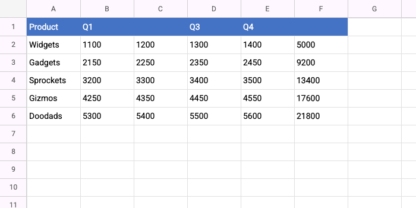

# Worksheet Widget

[](https://pub.dev/packages/worksheet)
[](https://opensource.org/licenses/MIT)
[](https://github.com/sjhorn/worksheet/actions/workflows/tests.yml)
[](https://codecov.io/gh/sjhorn/worksheet)

A Flutter widget that brings Excel-like spreadsheet functionality to your app.



Display and edit tabular data with smooth scrolling, pinch-to-zoom, and cell selection - all running at 60fps even with hundreds of thousands of rows.

## Try It In 30 Seconds

```dart
import 'package:flutter/material.dart';
import 'package:worksheet/worksheet.dart';

void main() => runApp(MaterialApp(home: MySpreadsheet()));

class MySpreadsheet extends StatelessWidget {
  @override
  Widget build(BuildContext context) {
    final data = SparseWorksheetData(rowCount: 100, columnCount: 10, cells: {
        (0, 0): 'Name'.text,
        (0, 1): 'Amount'.text,
        (1, 0): 'Apples'.text,
        (1, 1): '42'.number,
        (2, 1): '=2+42'.formula,
        (3, 1): Cell.text('test'),
    });

    

    return Scaffold(
      body: WorksheetTheme(
        data: const WorksheetThemeData(),
        child: Worksheet(
          data: data,
          rowCount: 100,
          columnCount: 10,
        ),
      ),
    );
  }
}
```

That's it! You now have a scrollable, zoomable spreadsheet with row/column headers.

## Add Selection and Editing

Want users to select and edit cells? Add a controller and callbacks:

```dart
class EditableSpreadsheet extends StatefulWidget {
  @override
  State<EditableSpreadsheet> createState() => _EditableSpreadsheetState();
}

class _EditableSpreadsheetState extends State<EditableSpreadsheet> {
  final _data = SparseWorksheetData(rowCount: 1000, columnCount: 26);
  final _controller = WorksheetController();

  @override
  Widget build(BuildContext context) {
    return Scaffold(
      body: WorksheetTheme(
        data: const WorksheetThemeData(),
        child: Worksheet(
          data: _data,
          controller: _controller,
          rowCount: 1000,
          columnCount: 26,
          onCellTap: (cell) {
            print('Tapped ${cell.toNotation()}');  // "A1", "B5", etc.
          },
          onEditCell: (cell) {
            // Double-tap triggers edit - implement your editor UI
            print('Edit ${cell.toNotation()}');
          },
        ),
      ),
    );
  }

  @override
  void dispose() {
    _controller.dispose();
    _data.dispose();
    super.dispose();
  }
}
```

Now you can:
- Click cells to select them
- Use arrow keys to navigate
- Track selection via `_controller.selectedRange`
- Zoom with pinch gestures or `_controller.setZoom(1.5)`

## Style Your Data

Add colors, bold text, and conditional formatting:

```dart
// Header row styling
const headerStyle = CellStyle(
  backgroundColor: Color(0xFF4472C4),
  textColor: Color(0xFFFFFFFF),
  fontWeight: FontWeight.bold,
  textAlignment: CellTextAlignment.center,
);

// Apply to cells
_data.setStyle(const CellCoordinate(0, 0), headerStyle);
_data.setStyle(const CellCoordinate(0, 1), headerStyle);

// Highlight negative numbers in red
final value = _data.getCell(CellCoordinate(row, col));
if (value != null && value.isNumber && value.asDouble < 0) {
  _data.setStyle(
    CellCoordinate(row, col),
    const CellStyle(textColor: Color(0xFFCC0000)),
  );
}
```

## Handle Large Datasets

The widget uses sparse storage and tile-based rendering, so this works smoothly:

```dart
// Excel-sized grid: 1 million rows, 16K columns
final data = SparseWorksheetData(
  rowCount: 1048576,
  columnCount: 16384,
);

// Only populated cells use memory
for (var row = 0; row < 50000; row++) {
  data.setCell(
    CellCoordinate(row, 0),
    CellValue.text('Row ${row + 1}'),
  );
}
// Memory usage: ~50K cells, not 17 billion empty cells
```

---

## Why This Widget?

### Built for Performance

- **Tile-based rendering**: Only visible cells are drawn, cached as GPU textures
- **60fps scrolling**: Smooth even with 100K+ populated cells
- **10%-400% zoom**: Pinch to zoom with automatic level-of-detail
- **O(log n) lookups**: Binary search for row/column positions

### Built for Real Apps

- **Sparse storage**: Memory scales with data, not grid size
- **Full selection**: Single cell, ranges, entire rows/columns
- **Keyboard navigation**: Arrow keys, Tab, Enter, Home/End
- **Resize support**: Drag column/row borders to resize
- **Theming**: Full control over colors, fonts, headers

### Built with Quality

- **SOLID principles**: Clean separation of concerns
- **Test coverage**: 87%+ with unit, widget, and performance tests
- **TDD workflow**: Tests written before implementation

---

## Documentation

| Guide | Description |
|-------|-------------|
| [Getting Started](GETTING_STARTED.md) | Installation, basic setup, enabling editing |
| [Cookbook](COOKBOOK.md) | Practical recipes for common tasks |
| [Performance](PERFORMANCE.md) | Tile cache tuning, large dataset strategies |
| [Theming](THEMING.md) | Colors, fonts, headers, selection styles |
| [Testing](TESTING.md) | Unit tests, widget tests, benchmarks |
| [API Reference](API.md) | Quick reference for all classes and methods |
| [Architecture](ARCHITECTURE.md) | Deep dive into the rendering pipeline |

---

## Installation

Add to your `pubspec.yaml`:

```yaml
dependencies:
  worksheet: ^1.0.0
```

Then run:

```bash
flutter pub get
```

---

## Keyboard Shortcuts

| Key | Action |
|-----|--------|
| Arrow keys | Move selection |
| Shift + Arrow | Extend selection |
| Tab / Shift+Tab | Move right/left |
| Enter / Shift+Enter | Move down/up |
| Home / End | Start/end of row |
| Ctrl+Home | Go to A1 |
| F2 | Edit current cell |
| Delete | Clear cell |

---

## Quick API Overview

```dart
// Data
final data = SparseWorksheetData(rowCount: 1000, columnCount: 26);
data.setCell(CellCoordinate(0, 0), CellValue.text('Hello'));
data.setCell(CellCoordinate(0, 1), CellValue.number(42));
data.setStyle(CellCoordinate(0, 0), CellStyle(fontWeight: FontWeight.bold));

// Controller
final controller = WorksheetController();
controller.selectCell(CellCoordinate(5, 3));
controller.selectRange(CellRange(0, 0, 10, 5));
controller.setZoom(1.5);  // 150%
controller.scrollTo(x: 500, y: 1000, animate: true);

// Cell values
CellValue.text('Hello')
CellValue.number(42.5)
CellValue.boolean(true)
CellValue.date(DateTime.now())
CellValue.formula('=SUM(A1:A10)')
```

---

## Running the Example

```bash
cd example
flutter run
```

The example app demonstrates:
- 50,000 rows of sample sales data
- Cell editing with double-tap
- Column/row resizing
- Zoom slider (10%-400%)
- Keyboard navigation

---

## Running Tests

```bash
flutter test                    # Run all tests
flutter test --coverage         # With coverage report
flutter test test/core/         # Run specific directory
```

---

## License

MIT License - see [LICENSE](LICENSE) for details.
